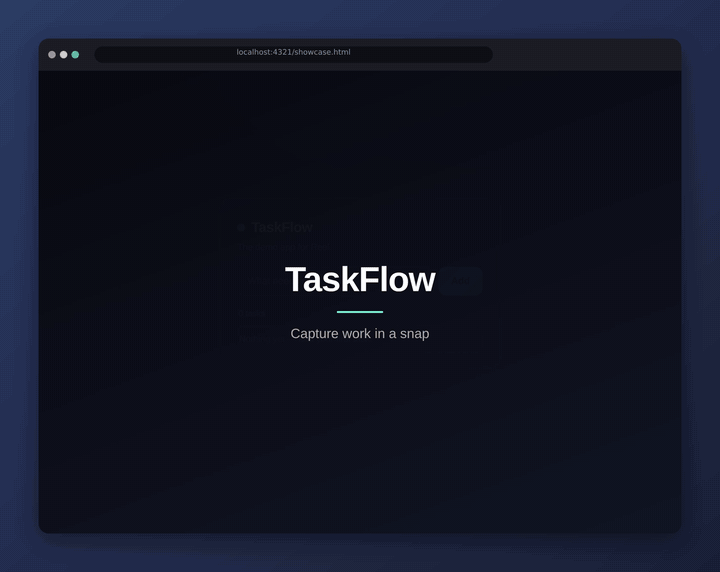

<p align="center">
  
</p>
<h1 align="center">Reel</h1>
<p align="center"><em>Lights, camera, code.</em></p>

<p align="center">
  <strong>Open-source demos-as-code for web apps.</strong><br/>
  Describe it or script it — Reel drives your <em>real</em> app and renders a
  polished, always-current demo, and fails your build when the flow breaks.
  Use it from the <strong>CLI</strong> or the <strong>Studio UI</strong>.
</p>

<p align="center">
  
  <br/><sub>☝️ This GIF was generated by Reel from a 20-line spec, in CI.</sub>
</p>

---

What [VHS](https://github.com/charmbracelet/vhs) is to terminal demos, Reel is to
**web apps** — with two things VHS doesn't have:

1. **AI-native authoring** — describe the demo, an agent drives your app and
   writes a reproducible spec _(v0.3)_.
2. **CI-native drift detection** — your demo is a test. If a step can't complete,
   the build fails; on merge, the README media auto-updates.

100% MIT, no SaaS, no hosting. A CLI + a GitHub Action. Everything runs locally
and in CI.

## Quick start

```bash
npm install            # or: npm i -g reel
npx playwright install chromium

# Scaffold a spec, then record it
npx reel init
npx reel record demo.reel.yaml
```

Try the bundled example (boots its own app, records a GIF/MP4/storyboard):

```bash
npx reel record examples/taskflow/demo.reel.yaml
```

## Reel Studio (web UI)

Prefer a UI? Reel ships a local **Studio** (Next.js + Tailwind, in this repo under
`studio/`) with everything the CLI does — AI authoring, a spec editor, output
options, record with a live preview, drift-check, and self-heal.

```bash
npm run studio:install   # one-time: install the studio's deps
reel ui                  # starts the API + UI and opens your browser
```

It runs entirely locally: an in-process API (Playwright/ffmpeg) plus the Next.js
frontend, which proxies data and media back to it.

## The spec

A demo is a small, reviewable file that diffs cleanly in PRs. Waits are on
**states, not time** — the reliability moat. One spec renders every format.

```yaml
name: TaskFlow — add and complete a task
url: http://localhost:4321
viewport: { width: 1000, height: 720, scale: 2 }
theme: dark

run:                         # optional: boot the app under test
  cmd: node server.mjs
  readyOn: http://localhost:4321

deterministic:               # make real apps reproducible
  disableAnimations: true
  freezeClock: "2026-01-01T09:00:00Z"
  locale: en-US              # pin formatting — a frozen clock isn't enough
  timezone: UTC

polish:
  zoom: auto                 # camera eases toward the active element
  cursor: smooth
  captions: true
  frame: browser             # none · browser · window (device chrome)
  background: "linear-gradient(135deg, #2b3a67, #1a1f36)"

steps:
  - caption: "Meet TaskFlow — capture work in a snap"
  - beat: hero
  - type: { selector: "#task-input", text: "Ship the Reel demo" }
  - click: role=button[name=Add]
  - waitFor: text=Ship the Reel demo     # state-based, not sleep()
  - caption: "Click a task to complete it"
  - click: text=Ship the Reel demo
  - beat: done

output:
  preset: share              # share · readme · social · hq · docs
  mp4: out/taskflow.mp4
  gif: out/taskflow.gif
  webm: out/taskflow.webm
  storyboard: out/storyboard
  html: out/taskflow.html    # self-contained interactive click-through
```

## Scene grammar — demos that are directed, not just recorded

A screen recording is one continuous take. Reel gives a demo *structure*, so it
reads like something a person made on purpose:

```yaml
steps:
  - card: { title: "TaskFlow", subtitle: "Capture work in a snap" }   # open on a title
  - caption: { text: "Add a task in one click", ms: 1800 }            # timed, wraps, fades
  - click: role=button[name=Add]
  - expect: { selector: "#list li", count: 1 }                        # assert, don't assume
  - callout: { selector: "#count", text: "The counter tracks what's open" }
  - scroll: { to: "#pricing", ms: 1100 }                              # cinematic pan
  - zoom: { to: "#pricing h2", level: 1.7 }                           # explicit camera
  - zoom: out
  - card: { title: "One spec. Every format." }                        # close on a title
```

| step | what it does |
|---|---|
| `card` | Full-screen title card — opens, closes, or separates chapters. Also lands in the storyboard. |
| `callout` | Spotlights an element: everything else dims, an accent ring draws around it, an optional label explains it. |
| `scroll` | Eased travel down a long page. Also asserts nothing — pair with `expect`. |
| `zoom` | Explicit camera control (`to`, `level`, `ms`), or `out` for a wide shot, when auto-zoom's guess isn't your story. |
| `expect` | An assertion on `text`, `count`, or visibility — what makes `reel check` a real smoke test. |
| `caption` | Now takes `{ text, ms, position }`; it wraps at real word boundaries and fades in and out. |

Run the bundled example to see all of it at once:

```bash
npx reel record examples/taskflow/showcase.reel.yaml
```

**Scrolling is rendered, not recorded.** Capturing a live scroll races Chromium's
rasterizer — roughly a third of frames come back with a blank band where the
compositor hasn't caught up, and no combination of launch flags or slower
scrolling avoids it. So `scroll` takes one settled full-page capture and pans a
viewport-sized window down it with easing: artifact-free, at the full output
frame rate, for the cost of a single screenshot. The tradeoff is that
`position: fixed` elements are captured once, at the top — pages with sticky
headers should use `scrollTo`, which jumps instead.

## Interactive HTML — the format a GIF can't be

A recorded demo is passive: the viewer watches at your pace. Add one line and the
same spec also builds a **self-contained click-through** — every element you
acted on becomes a hotspot, and the viewer advances at their own pace:

```yaml
output:
  gif: docs/demo.gif
  html: docs/demo.html      # one file — no hosting, no scripts, no tracking
```

- **Hotspots** on the exact elements the demo interacted with, pulsing in your
  accent colour.
- **Chapters** from your title cards, as a clickable rail.
- **Deep links.** Every scene is addressable — `demo.html#/create-a-project` for
  a chapter, `#/step-4` for anything else — with working Back and Forward, and a
  *Copy link* button. Link a support reply straight at the step that matters.
- **Autoplay that breathes.** Paced by the durations actually recorded, so a
  title card lingers and a click doesn't. The progress track fills in real time.
- **Keyboard, touch and screen readers.** `←` `→` `Home` `End` to step, `space`
  to play, swipe on a phone, a live region announcing each step, visible focus
  rings, and `prefers-reduced-motion` respected.
- **Light and dark**, following the viewer's system preference.
- **Embeddable.** `?embed=1` drops the chrome for an `<iframe>`, and the player
  reports progress to the host page and takes commands back:

  ```js
  frame.contentWindow.postMessage({ type: 'reel:go', index: 4 }, '*');
  window.addEventListener('message', (e) => {
    if (e.data.type === 'reel:scene') console.log(e.data.index, e.data.chapter);
  });
  ```

  Same-origin hosts can skip the messaging and use `frame.contentWindow.reelDemo`
  directly.
- **One file.** Frames are embedded as data URIs — the showcase demo is ~205 KB
  for 10 scenes. Open it locally, commit it to `docs/`, or drop it on any static
  host. Nothing phones home.

This is the shape interactive-demo SaaS sells; here it falls out of the spec you
already wrote. It uses the raw frames rather than the polished video, so hotspot
coordinates map exactly to what you see.

`npm run test:player` drives a generated build in a real browser — 26 checks over
the router, autoplay, embed mode, the host API and the accessibility surface.

## Branching — let the viewer choose

Some demos have more than one story. A `branch` step forks the flow, and the
click-through lets the viewer pick:

```yaml
steps:
  - type: { selector: "#task-input", text: "Ship the Reel demo" }
  - click: role=button[name=Add]

  - branch:
      prompt: "What do you want to see?"
      paths:
        - label: "Complete a task"
          default: true              # the path the video follows
          steps:
            - click: text=Ship the Reel demo
            - expect: { selector: "#count", text: "0 of 1" }
        - label: "Add a second task"
          steps:
            - type: { selector: "#task-input", text: "Write the README" }
            - click: role=button[name=Add]

  - caption: "Both paths end up here"   # the shared continuation
```

**A video is linear**, so the GIF/MP4 follows the path marked `default: true`.
The interactive build carries all of them — it's the one format that can.

**An app has state**, so alternates can't be spliced in afterwards. Reel replays
the steps leading up to the branch and then records that path, which is the only
approach that holds for an app it knows nothing about. The replay is silent: no
frames, no demo time. Alternates are captured as stills, so they can never leak
into the video.

**Every path is checked.** `reel check` walks all of them, so a branch the video
never shows is still a tested flow — break an assertion on the path not taken and
the build fails.

Two constraints worth knowing:

- A fresh browser context resets cookies and storage, **not a server's
  database**. For a server-backed app, pin responses with `mock:` so every path
  starts from the same state.
- Branches don't nest in v1 — a nested branch is a spec error, not a silent
  no-op. Recording a tree deeper than one level multiplies the trunk replays.

See [`examples/taskflow/branching.reel.yaml`](examples/taskflow/branching.reel.yaml),
and `npm run test:branch` for the end-to-end checks.

## Delivery presets — the same demo, shared many ways

A demo isn't only a README GIF. Reel captures the flow once and renders whatever
you're sharing into — pick a **preset** (or override any field: `fps`,
`maxWidth`, `gifFps`, `gifMaxWidth`, `gifColors`).

| preset | best for | tuned for |
|---|---|---|
| `share` *(default)* | anywhere — chat, docs, PRs | balanced quality/size |
| `readme` | README hero GIFs | smallest GIF (~640px, trimmed palette) |
| `social` | Twitter/LinkedIn embeds | crisp, video-first |
| `hq` | landing pages, decks | maximum fidelity |
| `docs` | product docs | clean, moderate |

Formats are chosen by which paths you set: `mp4` (crisp video, best for social/
embeds/docs), `gif` (lightweight loop for READMEs and chat), `webm` (small modern
video), `storyboard` (a PNG per beat), and `html` (the interactive click-through
above). The MP4 is the highest-quality artifact; the GIF is intentionally the
lightweight one. An `html`-only spec skips video encoding entirely, so it's fast.

## Subtitles & localization

Your captions can also become **subtitles** — opt in from the output block:

```yaml
output:
  mp4: out/demo.mp4
  subtitles: true          # sidecar .srt + .vtt from the captions
  languages: ["es", "fr"]  # localized subtitle variants
```

- **Subtitles** — SRT/VTT sidecars for players, accessibility, and platforms.
- **Localization** — the LLM translates the captions per language and emits
  localized `demo.es.srt` / `demo.es.vtt`, etc.

> Demos are **silent** by design right now. Synthesized voiceover sounded robotic
> enough to hurt the demo, so it was removed rather than shipped half-good;
> narration will come back once it's genuinely engaging.

## Trustworthy data & privacy

Ship demos externally without leaking real data or catching a flaky backend:

```yaml
redact: [".user-email", ".avatar", "#account-number"]   # blurred in every frame
mock:
  routes:
    - url: "**/api/account"
      json: { name: "Jane Rivera", balance: "$12,480.00" }
  # har: fixtures/demo.har                                # or replay a whole HAR
```

- **Redaction** — matching elements are blurred (or boxed) via an injected
  MutationObserver, so even content added mid-demo (new rows, avatars) is covered.
- **Mock data** — pin network responses (route stubs or a HAR replay) so the demo
  shows clean, consistent content regardless of backend state. Applied to `record`,
  `check`, and `heal`.

## Polish

- **Auto-zoom** — the camera eases toward whatever you interact with and pulls
  back for hero/outro beats. Cropping happens in post on lossless frames; with a
  device frame the chrome stays fixed while the content zooms *inside* it.
- **Device frames** — `frame: browser` wraps the app in a macOS-style window with
  traffic-light dots and a URL pill; `window` drops the URL; `none` is bare.
- **Padding & background** — a padded backdrop (solid color or `linear-gradient`)
  with a soft drop shadow and rounded corners (`radius`).
- **Synthetic cursor** — a real OS cursor doesn't exist headless, so Reel draws
  one and eases it between targets, with a click ripple.
- **Captions** — composited onto the output (so a zoomed crop never clips them),
  wrapped at real word boundaries using advances measured by the browser's own
  text engine, and faded in and out rather than hard-cut.
- **Spotlight callouts** — dim everything but one element, ring it in your accent
  colour, and label it.
- **Title cards** — open and close on a card, or use one to separate chapters.

## Terminal demos

Reel renders the terminal itself, as a layer in the same document it uses for
web demos — so a CLI demo gets captions, title cards, device frames, the
deterministic timeline and every output format, and **one spec can show a
command and the browser it affects**:

```yaml
terminal:
  cols: 84
  rows: 20
  prompt: "~/app $ "

steps:
  - run: npm run build          # types it, runs it for real, replays the output
  - expectOutput: "built in"    # a real assertion, checked by `reel check`
  - run: { cmd: npm test, expectCode: 0 }
  - show: app                   # cut to the browser
  - click: text=Deploy
```

Commands genuinely execute, so `reel check` is a smoke test of your CLI. Output
is captured to completion and then *replayed* on camera at a bounded pace —
which is why a 60-second install becomes two seconds of film, and why the result
is byte-identical every run.

Colour comes from `FORCE_COLOR`, which covers build tools, package managers, git
and bespoke CLIs. Full-screen TUIs need a real pty and aren't supported.

See [`examples/cli/demo.reel.yaml`](examples/cli/demo.reel.yaml).

## Reproducible output

The same spec against the same app renders **byte-identical media on any
machine**. Frame timestamps come from a virtual clock, not the wall clock: a
step advances the timeline by the duration it *declares*, and real waiting —
selectors, network, the app settling — costs no demo time at all. A loaded CI
runner produces exactly what your laptop did.

This is what makes committing demo media from CI worth doing. Without it every
push rewrites a multi-megabyte GIF whether or not the demo changed, and the diff
tells a reviewer nothing. With it, **a media change means the demo changed.**

```yaml
deterministic:
  timeline: true # default; false films the app's own animation in real time
```

## Pacing — control how long a demo runs

```yaml
polish:
  speed: 1.5              # multiplier over every authored duration
  trimIdle: 800           # cap still stretches (blunt: it also shortens holds)
output:
  targetDuration: 30s     # fit the finished demo to a length
```

`speed` scales as it records; `targetDuration` and `trimIdle` reshape the
recorded timeline afterwards, so neither re-runs the demo. Prefer `speed` or
`targetDuration` for a demo that's already paced — `trimIdle` can't tell dead
air from a deliberate pause.

## One spec, many variants

A docs page usually needs the same flow at desktop and mobile, in both themes.
That's one spec, not four:

```yaml
matrix:
  viewports:
    - { name: desktop, width: 1280, height: 800 }
    - { name: mobile, width: 390, height: 844, scale: 3 }
  themes: [light, dark]
output:
  gif: docs/demo-{viewport}-{theme}.gif
```

`reel check` walks every variant too — a responsive layout can hide an element
at one width and not another, and that's exactly the drift worth catching.

## Commands

| Command | What it does |
|---|---|
| `reel init [dir]` | Scaffold a starter `demo.reel.yaml`. |
| `reel record <spec>` | Drive the app and render GIF / MP4 / WebM / storyboard. |
| `reel check <spec>` | Re-run headlessly; **exit 1 if any step can't complete** (CI drift). |
| `reel heal <spec> [--write]` | Re-run; when a step breaks (UI drift), an agent re-resolves it, verifies the fix, and repairs the spec. |
| `reel ui` | Launch **Reel Studio**, the local web UI. |
| `reel author <story> --url <url>` | AI authoring — an agent drives your app and emits a spec you own. |

## Why it's reliable (and the plan's three hard problems)

Real web apps aren't terminals — they animate, read the clock, and fetch live
data. Reel closes that gap so demos don't drift or flake:

- **State-based waits.** Every action auto-waits on app state; `waitFor` blocks
  on selectors/URLs/network-idle, never a raw `sleep()`.
- **Assertions.** `expect` checks rendered text and element counts, so a passing
  `reel check` means the app still *works*, not just that selectors resolve.
- **Determinism controls.** Freeze the clock, pin locale and timezone, seed
  `Math.random`, disable animations/caret — installed before app code runs, on
  every document. Capture also waits on `document.fonts.ready`, so the opening
  frames never catch a flash of fallback text.
- **App lifecycle + auth.** A `run:` block boots your dev server and waits for it;
  `storageState` records logged-in flows.

## AI authoring — describe it, don't script it

```bash
reel author "sign up, create a project, invite a teammate" --url http://localhost:3000 -o signup.reel.yaml
```

An agent drives your **running** app in a headless browser: it snapshots the page,
works out the selectors, performs the story, and **verifies each step reached the
expected state** before it lands in the spec (so the emitted demo replays
reliably). The result is a normal `.reel.yaml` you own and edit — not a black
box. Re-run it against a changed UI to **update** a demo.

It directs, rather than just clicking through: alongside captions and hero/outro
beats it opens and closes on **title cards**, and **spotlights the payoff** — the
result you came for — with a one-line callout. A callout is verified like any
other step, so a spotlight never lands on an element that isn't there.

Model access is **provider-agnostic and BYO-key**, via a [LiteLLM](https://litellm.ai)
proxy's OpenAI-compatible endpoint — point it at Claude, Gemini, GPT, or anything
your proxy routes to. Configure it with a few env vars (see
[`.env.example`](.env.example)):

```bash
export LITELLM_API_BASE=https://your-proxy.example.com
export LITELLM_API_KEY=sk-...
export LITELLM_MODEL=your-model-name
export SSL_VERIFY=false   # for corporate proxies with non-verifying certs
```

## CI / drift detection

Copy [`.github/workflows/reel.yml`](.github/workflows/reel.yml): PRs run
`reel check` (fail if the demo broke) **and regenerate the media onto the PR
branch**, so a reviewer sees the new demo as an image diff in *Files changed*
without leaving the review. Pushes to `main` do the same, so your README GIF is
never lying.

That preview only works because output is deterministic — otherwise every PR
would carry a media change and the signal would be worthless.

**Flaky steps.** `retries: 2` re-runs a step that fails transiently. Retries are
deliberately narrow: steps that mutate nothing are always safe, while a click or
a type is retried only when the failure proves the action never landed — so a
retry can't double-submit a form.

**Self-healing.** When the UI drifts and a step breaks, `reel heal --write`
repairs the spec. It works through a ladder: candidates derived from what the
broken selector was reaching for (role, name, id, placeholder) are scored and
tried first, and every candidate is **verified by actually running the step**
before it's accepted. An LLM handles what the ladder can't — and is entirely
optional, so a renamed id or a relabelled button repairs offline with no API key.

> **Security.** `reel record` runs the spec's `run.cmd` in a shell — a
> `.reel.yaml` is executable code. Never run a spec you didn't write in a job
> holding secrets or write permissions. Set `REEL_NO_EXEC=1` to refuse to spawn
> `run.cmd` at all, and start the app yourself instead.

## Architecture

```
spec.yaml ─▶ loader/validator ─▶ driver (Playwright) ─▶ capture (retina screenshots)
                                      │                        │
                              determinism + state waits   timestamped 2× frames (deduped)
                                                               │
                                          overlay (cursor · captions · ripples)
                                                               │
                              auto-zoom: cfr expand · eased crop · caption composite (sharp)
                                                               │
                                        encoders: GIF · MP4 · WebM · storyboard
```

Frames are the substrate the whole polish pipeline builds on. Capture is a
timestamped `page.screenshot()` loop at **true retina (2×)** — the only path that
honors device-pixel-ratio (CDP screencast only ever yields CSS-resolution). Byte-
identical frames during static holds are deduped, so a long hold costs one frame,
and per-frame timestamps keep playback at the intended speed.

## Status

Alpha (v0.1). Working and dogfooded (the GIF above): the core runner,
determinism, retina capture, auto-zoom, device frames + padding/background,
polish (synthetic cursor + composited captions), the **scene grammar** (title
cards, spotlight callouts, rendered scrolling, explicit camera, assertions),
delivery presets, encoders (GIF/MP4/WebM/storyboard), **interactive HTML**,
AI authoring, **self-healing drift repair**, **subtitles + localization**, and
**PII redaction + mock data** — all provider-agnostic via a LiteLLM proxy. See [the product plan](<demosascodeproductplan (1).md>).

## License

[MIT](LICENSE).
